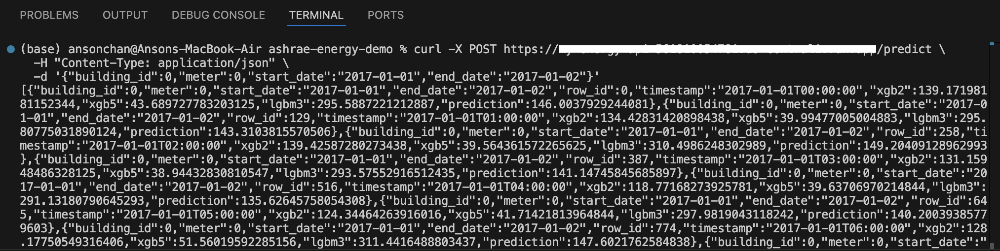
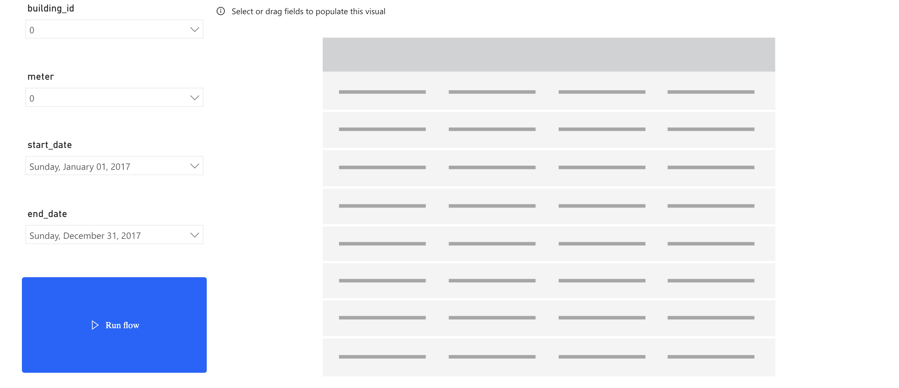
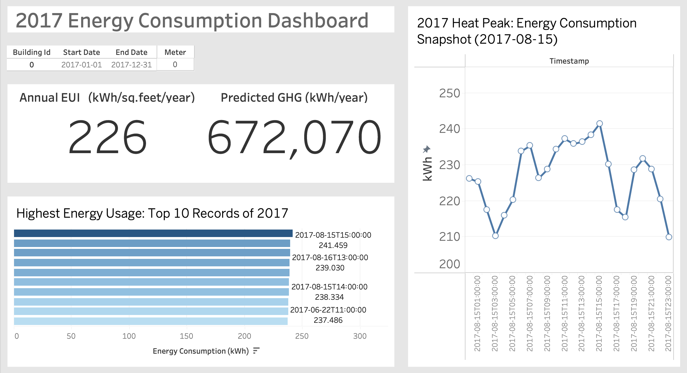

# Building Energy Performance Prediction  
_Enabling pay-for-performance energy financing, portfolio decarbonization, and deep retrofit feasibility studies_

---

## 🎬 Watch the Demo  
See the system in action in this 2-minute demo on YouTube:  
https://youtu.be/TDP8FHHZ2ak

---

## 🔍 Overview & Purpose  
Buildings account for a large share of global energy use and carbon emissions. Under **pay-for-performance (P4P) energy financing**, owners pay based on the **difference** between actual energy consumption and a modeled “business-as-usual” baseline—true “counterfactual” usage without retrofits. Accurate, scalable baseline models are essential:

> “Thankfully, significant investments are being made to improve building efficiencies to reduce costs and emissions. The question is, are the improvements working? That’s where you come in. Under pay-for-performance financing, the building owner makes payments based on the difference between their real energy consumption and what they would have used without any retrofits. The latter values have to come from a model. Current methods of estimation are fragmented and do not scale well. Some assume a specific meter type or don’t work with different building types.”  
> — Kaggle ASHRAE Energy Prediction

**This project** provides that model, serving:  
- **Chilled water, electricity, hot water, and steam meter** predictions  
- **Deep retrofit feasibility** assessments (e.g. insulation, HVAC upgrades)  
- **Building portfolio decarbonization studies**—apply across 1,000+ buildings  

_Engineers: no coding required—interact via a simple API and user-friendly dashboards._

---

## 📊 Data & Features  
- **Source**: ASHRAE Great Energy Predictor III [Kaggle](https://www.kaggle.com/competitions/ashrae-energy-prediction/overview)  
  - ​1,000+ commercial & institutional buildings  
  - 3 years of hourly meter data: chilled water, electric, hot water, steam  
  - Building metadata: footprint, primary use (office, retail, lab, etc.), year built  
  - Weather data: temperature, dew point, precipitation  

- **Model Inputs**:  
  - **Metadata**: `square_feet`, `primary_use`, `year_built`  
  - **Time**: hour of day, day-of-week, weekend flag  
  - **Weather**: rolling means & lags of temperature, dew point (3 h, 18 h, 72 h)  
  - **Meter readings**: log-transformed kWh/ft² per meter type  

- **Feature Engineering Highlights**:  
  - **Aggregate statistics** by building (mean, median, skew of usage)  
  - **Exception labels** to flag and exclude outliers  
  - **Target encoding** per building & meter type  

---

## 🤖 Model Architecture  
A **weighted blend** of three gradient-boosted tree models predicts hourly meter usage:

| Model              | Folds | Scope             |
|--------------------|-------|-------------------|
| 2-fold XGBoost     | 2     | All buildings     |
| 5-fold XGBoost     | 5     | Per meter type    |
| 3-fold LightGBM    | 3     | No leak data fork |

Final prediction = _w₁·XGB2 + w₂·XGB5 + w₃·LGBM3_  
> **Key drivers**: building size, primary use, outdoor temperature, time features.

---

## ☁️ API Usage
- **Request(JSON)**:
{
  "building_id": 123,
  "meter": 0,
  "start_date": "2017-01-01",
  "end_date":   "2017-12-31"
}
- **Response(JSON)**:
- {
  "predictions":[
    { "building_id": 123, "meter": 0, "start_date": "2017-01-01", "end_date": "2017-01-02",
      "row_id":1, "timestamp":"2020-01-01T00:00Z",
      "xgb2":10.2, "xgb5":9.8, "lgbm3":10.0, "prediction":9.95
    },
    …  
  ]
}

---

## 📈 Dashboards
**Power BI Service/ Tableau**
- **Input**: slicers for Building ID, Meter, Start/End dates
- **Action**: “Get Prediction” Power Automate button
- **Streaming Dataset** → real-time update
- **Visuals**:
  - **KPI Cards** annualized EUI, GHG emissions
  - **trends**
  - etc.

---

## ⚠️ Obstruction
- **Power BI Desktop on Mac** unavailable; used Tableau locally.
- **Baseline accuracy** sensitive to outliers & missing weather data.
   
---

## 🌟 AI’s Role in Energy Financing
- **Automated baselines**: Establish objective “would-have-used” energy curves.
- **Savings validation**: Quantify real post-retrofit performance for P4P contracts.
- **Interactive scenario planning**: Engineers test deep retrofit feasibility instantly.
- **Portfolio decarbonization**: Scale across hundreds of assets for enterprise finance.
   
---

## 📚 Next Steps & Contributions
- Two-way Power BI ↔ API integration (parameterized refresh)
- Expand scenarios: on-site renewables, demand response modeling

Contributions welcome – please open an issue or pull request!
   
---

## ⚖️ License
Licensed under the MIT License.

  
